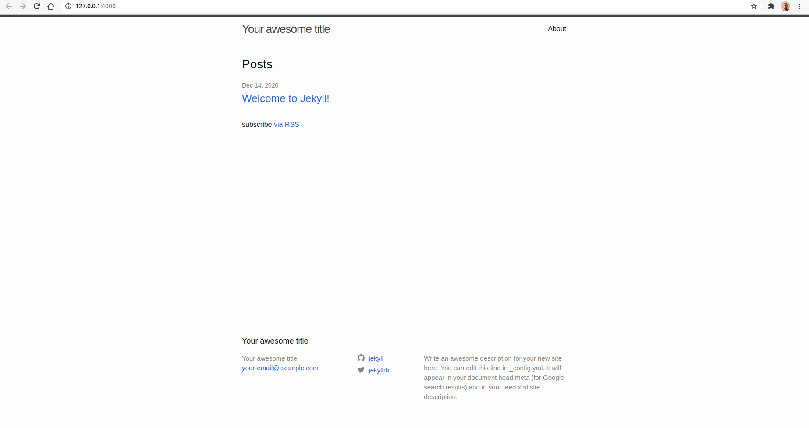
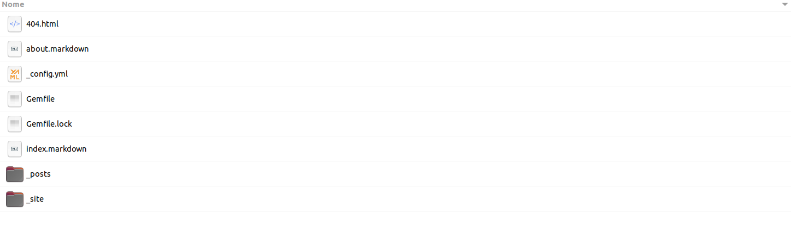
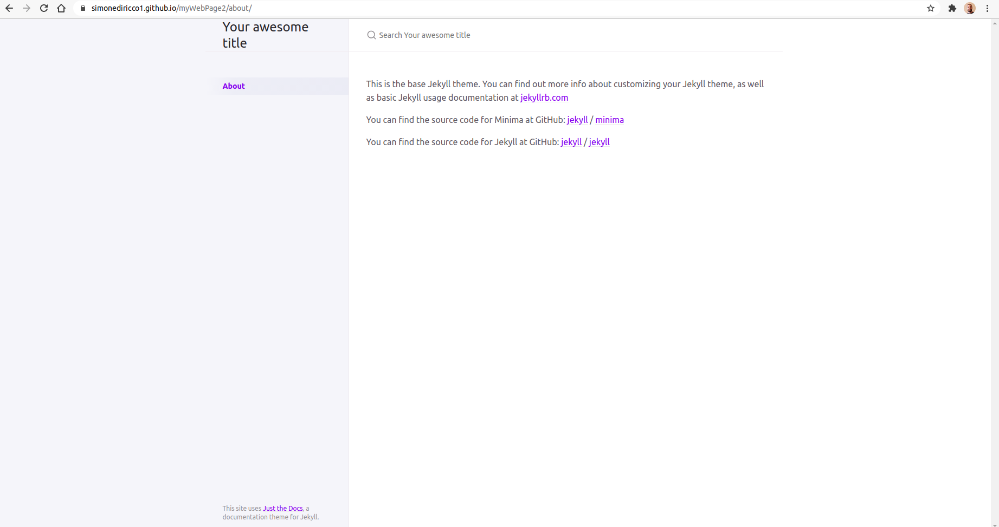

#  Crea il tuo sito tramite GitHub Pages e jekyll

Jekyll è un semplice generatore di siti statici, compatibile con i blog, per siti personali, di progetto o di organizzazione. Scritto in Ruby da Tom Preston-Werner, co-fondatore di GitHub, è distribuito con licenza open source MIT

## Prerequisiti

Devi aver installato [jekyll](https://jekyllrb.com/docs/installation) e [git]()

## Installazione di jekyll su Ubuntu

Devi installare tutte le dipendenze:
- [ruby](https://www.ruby-lang.org/en/downloads/)
- [rubygems](https://rubygems.org/pages/download)
- [gcc](https://gcc.gnu.org/install/)
- [make](https://www.gnu.org/software/make/)

Il seguente comando installa tutte le dipendenze necessarie:

```bash
sudo apt-get install ruby-full build-essential zlib1g-dev
```

Evita di installare i pacchetti RubyGems (chiamati gems) come utente root. Invece, imposta una directory di installazione gem per il tuo account utente. I seguenti comandi aggiungeranno variabili d'ambiente al tuo file `~ / .bashrc` per configurare il percorso di installazione di gem:

```bash
echo '# Install Ruby Gems to ~/gems' >> ~/.bashrc
echo 'export GEM_HOME="$HOME/gems"' >> ~/.bashrc
echo 'export PATH="$HOME/gems/bin:$PATH"' >> ~/.bashrc
source ~/.bashrc
```

Installa jekyll e bundler

```bash
gem install jekyll bundler
```

[Jekyll on Ubuntu](https://jekyllrb.com/docs/installation/ubuntu/)

Con questa procedura installerai l'ultima versione di jekyll. Per verificare la versione installata digita: 

```bash
jekyll -v
```

In generale la versione di jekyll appena installata differisce da quella utilizzata da GitHub Pages per il deploy (pubblicazione) di una pagina web. Per verificare la versione utilizzata da GitHub Pages, visita [GitHub pages - Dependency versions](https://pages.github.com/versions/).


Per evitare problemi consiglio di allinearsi alla versione di jekyll utilizzata da GitHub Pages ma solo in fase di creazione di un nuovo sito, quindi con un'installazione locale alla directory contente il progetto. Nei prossimi passaggi vedremo come fare..


### Crea il tuo primo sito

Crea una nuova directory con un nome a piacere, ad esempio `myWebPage`. 

Apri il terminale all'interno della repository appena creata e digita il comando per creare una nuova base per il sito.

```bash
jekyll new .
```

Adesso, lanciando il comando:

```bash
jekyll serve
```

Dovrebbe rispondere con qualcosa del genere:

```bash
Configuration file: /home/s/Repository/myWebPage/_config.yml
            Source: /home/s/Repository/myWebPage
       Destination: /home/s/Repository/myWebPage/_site
 Incremental build: disabled. Enable with --incremental
      Generating... 
       Jekyll Feed: Generating feed for posts
                    done in 0.211 seconds.
 Auto-regeneration: enabled for '/home/s/Repository/myWebPage'
    Server address: http://127.0.0.1:4000/
  Server running... press ctrl-c to stop.
```

Raggiungi l'indirizzo indicato dal campo `Server address`, nel mio caso `http://127.0.0.1:4000/`, da terminale è sufficiente un `Ctrl + click` o semplicemente copiando l'indirizzo su browser web.

A questo punto dovresti vedere l'anteprima del tuo sito. Di default verrà impostato un tema dal nome `minima`



Non ti preoccupare adesso dei contenuti, avrai modo di configurarli con calma una volta finito il setup. Come dicevo, adesso ti consiglio di allinearti alla versione di jekyll utilizzata da GitHub Pages. Apri la directory del progetto, nel mio caso `myWebPage`.

Troverai una serie di file:

 

La nostra concentrazione per adesso va ai file `Gemfile`, `Gemfile.lock` e `_config.yml`. 
Apri il file `Gemfile`, troverai questo contenuto scritto nel linguaggio `Ruby`:

```ruby
source "https://rubygems.org"
# Hello! This is where you manage which Jekyll version is used to run.
# When you want to use a different version, change it below, save the
# file and run `bundle install`. Run Jekyll with `bundle exec`, like so:
#
#     bundle exec jekyll serve
#
# This will help ensure the proper Jekyll version is running.
# Happy Jekylling!
gem "jekyll", "~> 4.1.1"
# This is the default theme for new Jekyll sites. You may change this to anything you like.
gem "minima", "~> 2.5"
# If you want to use GitHub Pages, remove the "gem "jekyll"" above and
# uncomment the line below. To upgrade, run `bundle update github-pages`.
# gem "github-pages", group: :jekyll_plugins
# If you have any plugins, put them here!
group :jekyll_plugins do
  gem "jekyll-feed", "~> 0.12"
end

# Windows and JRuby does not include zoneinfo files, so bundle the tzinfo-data gem
# and associated library.
platforms :mingw, :x64_mingw, :mswin, :jruby do
  gem "tzinfo", "~> 1.2"
  gem "tzinfo-data"
end

# Performance-booster for watching directories on Windows
gem "wdm", "~> 0.1.1", :platforms => [:mingw, :x64_mingw, :mswin]
```

Tra i commenti del file troviamo diverse indicazioni su come procedere per utilizzare GitHub Pages. In particolare devi impostare la versione di jekyll utilizzata da GitHub, nel mio caso `3.9.0`, consultabile da [GitHub pages - Dependency versions](https://pages.github.com/versions/). 

```ruby
gem "jekyll", "~> 3.9.0"
```

e devi inserire anche la direttiva giusta per github-pages con l'attuale versione di GitHub Pages consultabile sempre da [GitHub pages - Dependency versions](https://pages.github.com/versions/). Nel mio caso la versione è la `209`

```ruby
gem "github-pages", "~> 209",  group: :jekyll_plugins
```

Il file completo sarà:

```ruby
source "https://rubygems.org"
# Hello! This is where you manage which Jekyll version is used to run.
# When you want to use a different version, change it below, save the
# file and run `bundle install`. Run Jekyll with `bundle exec`, like so:
#
#     bundle exec jekyll serve
#
# This will help ensure the proper Jekyll version is running.
# Happy Jekylling!

gem "jekyll", "~> 3.9.0"
# This is the default theme for new Jekyll sites. You may change this to anything you like.
gem "minima"
#gem "minima", "~> 2.5"
# If you want to use GitHub Pages, remove the "gem "jekyll"" above and
# uncomment the line below. To upgrade, run `bundle update github-pages`.
gem "github-pages", "~> 209",  group: :jekyll_plugins
# If you have any plugins, put them here!
group :jekyll_plugins do
  gem "jekyll-feed", "~> 0.12"
end

# Windows and JRuby does not include zoneinfo files, so bundle the tzinfo-data gem
# and associated library.
platforms :mingw, :x64_mingw, :mswin, :jruby do
  gem "tzinfo", "~> 1.2"
  gem "tzinfo-data"
end

# Performance-booster for watching directories on Windows
gem "wdm", "~> 0.1.1", :platforms => [:mingw, :x64_mingw, :mswin]
```


A questo punto puoi salvare ed eliminare il file `Gemfile.lock`. Questo file infatti contiene tutte le dipendenze ed è generato a partire dal file `Gemfile`. Ne dovrai generare uno nuovo.

Da terminale, all'interno della directory del progetto digita:

```bash
bundle install
```

Verrà generato un nuovo `Gemfile.lock` con tutte le dipendenze necessarie per GitHub Pages.

Adesso, per lanciare l'anteprima della pagina, non puoi più utilizzare il comando `jekyll serve` poichè tale comando invocherà la versione di jekyll installata globalmente sul tuo PC e quindi risulteresti non allineato. Dovrai lanciare il comando `bundle exec jekyll serve` come suggerito dal file `Gemfile` in modo da garantire che venga eseguita la versione di jekyll indicata dal file `Gemfile` e non quella installata su PC.

Digita quindi:

```bash
bundle exec jekyll serve
```

A questo punto sei quasi pronto per pubblicare il tuo sito tramite GitHub Pages.


# Pubblica il sito su GitHub Pages

Crea una repository vuota e pubblica su GitHub. Ti consiglio di dare lo stesso nome della directory utilizzata nel progetto, nel mio caso `myWebPage`. Il nome appena creato coinciderà con la subdirectory dell'indirizzo della propria pagina web che nel mio caso sarà: `https://simonediricco1.github.io/myWebPage/`.

Adesso torna alla directory del progetto e aggiungiamo quindi il subpath `myWebPage` all'interno del file `_config.yml`, 

```yml
baseurl: "/myWebPage" # the subpath of your site, e.g. /blog
```

Il file completo sarà una cosa del genere:

```yml
# Welcome to Jekyll!
#
# This config file is meant for settings that affect your whole blog, values
# which you are expected to set up once and rarely edit after that. If you find
# yourself editing this file very often, consider using Jekyll's data files
# feature for the data you need to update frequently.
#
# For technical reasons, this file is *NOT* reloaded automatically when you use
# 'bundle exec jekyll serve'. If you change this file, please restart the server process.
#
# If you need help with YAML syntax, here are some quick references for you: 
# https://learn-the-web.algonquindesign.ca/topics/markdown-yaml-cheat-sheet/#yaml
# https://learnxinyminutes.com/docs/yaml/
#
# Site settings
# These are used to personalize your new site. If you look in the HTML files,
# you will see them accessed via {{ site.title }}, {{ site.email }}, and so on.
# You can create any custom variable you would like, and they will be accessible
# in the templates via {{ site.myvariable }}.

title: Your awesome title
email: your-email@example.com
description: >- # this means to ignore newlines until "baseurl:"
  Write an awesome description for your new site here. You can edit this
  line in _config.yml. It will appear in your document head meta (for
  Google search results) and in your feed.xml site description.
baseurl: "/myWebPage" # the subpath of your site, e.g. /blog
url: "" # the base hostname & protocol for your site, e.g. http://example.com
twitter_username: jekyllrb
github_username:  jekyll

# Build settings
theme: minima
plugins:
  - jekyll-feed

# Exclude from processing.
# The following items will not be processed, by default.
# Any item listed under the `exclude:` key here will be automatically added to
# the internal "default list".
#
# Excluded items can be processed by explicitly listing the directories or
# their entries' file path in the `include:` list.
#
# exclude:
#   - .sass-cache/
#   - .jekyll-cache/
#   - gemfiles/
#   - Gemfile
#   - Gemfile.lock
#   - node_modules/
#   - vendor/bundle/
#   - vendor/cache/
#   - vendor/gems/
#   - vendor/ruby/
```

A questo punto lancia nuovamente il comando:

```bash
bundle exec jekyll serve
```

Bene, sei pronti a trasformare la directory nella repository GitHub che ospiterà la tua pagina web.
Tramite git digita:

```bash
git init
git add .
git commit -m "initial"
git branch -M master
git remote add origin git@github.com:simonediricco1/myWebPage.git
git push -u origin master
```

Adesso, tornando su GitHub alla repository `myWebPage` dovresti trovare gli stessi file che hai localmente. Non resta che  istruire la repository ad ospitare una pagina web. Apri la Repository e vai su `Settings`, sezione `GitHub Pages`. Seleziona il branch `master`, premi il tasto `Save`, una volta aggiornata la pagina, se torni alla sezione `GitHub Pages` dovresti trovare:

```bash
Your site is published at https://simonediricco1.github.io/myWebPage/
```

Cliccando sul link dovresti visualizzare la tua pagina. Sei online!

## Temi jekyll

Adesso vedrai come impostare il tema [just-the-docs](https://github.com/pmarsceill/just-the-docs/) . Questo tema, non essendo tra quelli ufficialmente supportati da GitHub va aggiunto in un atro modo. Ovviamente questa guida vale anche per altri temi.

Modifica il `Gemfile` inserendo al posto di:

```bash
gem "minima"
```

Il tema `just-the-docs`:

```bash
gem "just-the-docs"
```

Modifica file `_config.yml` inserendo al posto di:

```bash
theme: minima
```

```bash
remote_theme: pmarsceill/just-the-docs
```

Adesso cancella il file `Gemfile.lock` e lancia nuovamente:

```bahs
bundle install
```

Per vedere l'anteprima lancia nuovamente il comando:

```bash
bundle exec jekyll serve
```

A questo punto esegui il commit e il push delle modifiche.

```bash
git add .
git commit -m "add other theme"
git push
```

Verrà eseguito il deploy in automatico. 


L'anteprima di questo tema è una cosa del genere:



### Risoluzione problemi

- [just-the-docs](https://stackoverflow.com/questions/56464757/trouble-implementing-specifically-just-the-docs-theme-using-jekyll)


